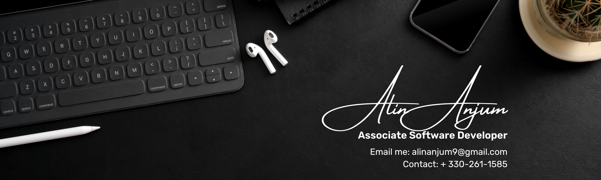

<h1 align = "center">Hello there!👋</h1>
<p1 >I'm Alin, a dedicated software developer who's deeply passionate about open-source projects and the tech community's vibrancy. I hold a degree in Computer Science, and ever since graduating, I've been immersed in crafting elegant solutions to intricate problems.</p1>

In my journey, I've honed expertise across various domains, including:

* Full-stack web development, where I thrive in using technologies like JavaScript, React.js, Node.js, and MongoDB.
* Data visualization and analysis, which I accomplish with Python and popular libraries such as Matplotlib and Pandas.
* Constructing scalable and efficient RESTful APIs.
* Embracing DevOps practices, where I excel in containerization with Docker and orchestration with Kubernetes.

I'm always hungry to learn and delve into emerging technologies. I firmly believe in the strength of collaboration and the importance of sharing knowledge. You can explore some of my latest projects and contributions right here on GitHub!

Let's stay connected! Feel free to reach out to me via email at alinanjum9@gmail.com. I'm excited to connect and explore new opportunities together.

